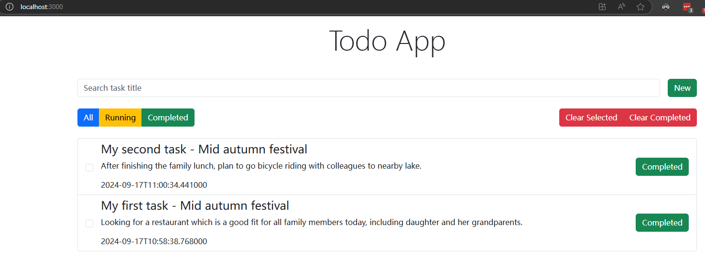

# TodoApp Web

This is the frontend of todo application, which is built on React + Redux + reactstrap.

## Architecture
This TodoApp is built based on `React`, and chooses `Redux` for state management. For component and style library, it uses `reactstrap`.

For large scale SPA, which uses React, the state mamagement usually uses `Redux thunk` or `Redux saga`. This web app, `Redux thunk` is selected for this scale & complexity of project.

From Redux official document, this is how the state flow:
https://redux.js.org/tutorials/essentials/part-1-overview-concepts
 

## Setup

Requirements:
* node.js

To run the project:
1. Clone this repo
2. Run `npm install`

The API server host configured in `itemActions.js`:
```js
axios.defaults.baseURL = 'http://127.0.0.1:8000/';
```

To simplify, the frontend uses a todolist to hold all todo items(configured in `itemActions.js`):
```
const todolist_id = "66e6a949a6adb29da224a811";
```

## Running 

Run in local:
`npm run start`

To generate static artifact for deployment:
 `npm run build`

## Features

### 1. Create new todo item
At the beginning, there is no todo items:


Let's add some items:


Now we have 3 todo items, and their states are in running (in progress).


### 2. Update todo item
To click the todo item state, mark it as done. For example, I completed the first & second todo items:


### 3. Filter the todo items by state
To click the status fitler, it shows running tasks or completed tasks only.


### 4. Delete todo item
To click the "Clear Selected" button, it only remove checked todo item. For example, select "My third task" and click "Clear Selected" button.




Then add 4th todo item as Running state, and click "Clear Completed". Only running state items will remain.


## Demo

This is a recorded demo for above features:
[Demo video](assets/7-demo.mp4)

And this is corresponding API log:
[API request logs](assets/7-api_logs)
